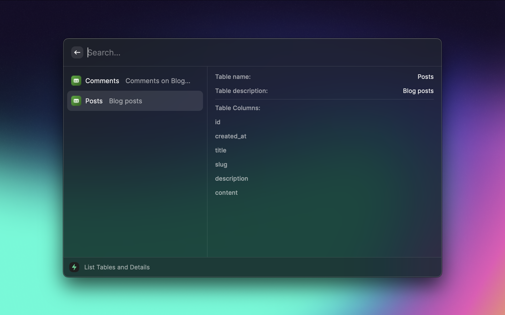

<br />
<p align="center">
  <p align="center">
    
    
</p>

  <h3 align="center">Supabase Raycast Extension</h3>

  <p align="center">
    🚧 atention this project is under development 🚧
    <br/>
    Secured & Simple <strong><a href="https://supabase.io/">Supabase</a> way to Visualizer, manage and query your Supabase project's from Raycast.</strong>
    <br />
    <br />
    <a href="https://github.com/Rychillie/raycast-supabase/issues">Report Bug</a>
    ·
    <a href="https://github.com/Rychillie/raycast-supabase/issues">Request Feature</a>
  </p>
</p>

<br />



## 🚀 Features

- Query all tables and list them
- Query all collumn names and list them

## 📇 About The Project

Raycast is an amazing tool for MacOS with amazing integrations, and I'm loving using it. That's why I found it interesting to create an extension that would allow me to use all the powers of Supabase and access them more quickly while I develop my projects.

## ROADMAP (to lauch v1):

The project is under development, i don't have the time to work on it, but i will try to work on it as much as i can. If you want to help, please open an issue or a pull request.

- [x] Query all tables and list them
- [x] Query all collumn names and list them on side
- [ ] Improve Types
- [ ] Query all rows and list them
- [ ] Editing tables
  - [ ] Add new row
  - [ ] Delete row
  - [ ] Edit row
  - [ ] Create new table
  - [ ] Delete table
  - [ ] Edit table
  - [ ] Create new column
  - [ ] Delete column
  - [ ] Edit column
- [ ] Query all users
  - [ ] Invite new user
  - [ ] Delete user
  - [ ] Edit user

## 🐾 Instructions

### 1. Clone this repository

```bash
git clone https://github.com/Rychillie/raycast-supabase.git
```

### 2. Install dependencies

```bash
yarn
// or
npm install
```

### 3. Run the project

```bash
yarn dev
// or
npm run dev
```

### 4. Open the project on Raycast

Open Raycast and type `Import Extension` and select the location folder.

### 5. Configure the project

Opne your projects on Supabase copy the Supabase URL and the Supabase Anon Key to use on Raycast.

### 6. Use it

Simple use the project on Raycast and enjoy it. If you have any suggestion or bug report, please open an issue.

## 📜 License

Not Associated with Supabase.

Distributed under the MIT License. See `LICENSE` for more information.

# 📧 Contact

Rychillie - [@rychillie](https://twitter.com/rychillie) - contact@rychillie.net - [rychillie.net](https://rychillie.net)

Also, if you like my work, please [sponsor me at github](https://github.com/sponsors/Rychillie)
